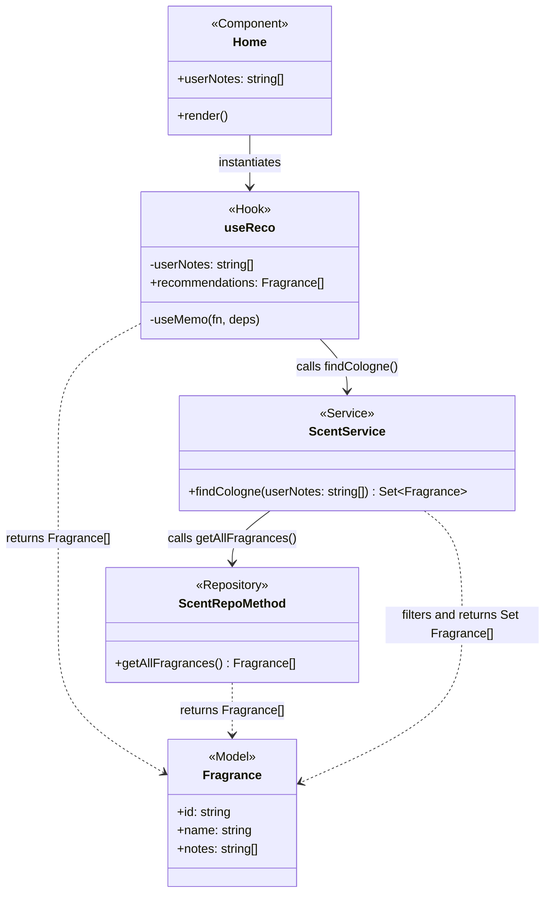

# `useReco`

The `Home.tsx` component now contains a Fragrance recommendation engine provided by a custom hook: `useReco`

- `useReco` accepts a single parameter of type string[]
- `useReco` expects an array of `userNotes` to passed as an argument when instantiated in a component.

<br/>


```tsx
const { recommendations } = useReco(userNote);
```

When iterated on `{ recommendations }` will return string values for Name, Notes, and Id

<br/>

### Hook Definition:


```tsx
const useReco = (userNotes: string[]): { recommendations: Fragrance[] } => {
  const recommendations = useMemo(() => {
    return Array.from(ScentService.findCologne(userNotes));
  }, [userNotes]);

  return { recommendations };
};
```
<br/>

Internally, `useReco` uses React's built in `useMemo()` hook to cache the return from findCologne function being called. The service depends on `userNotes` and will be called when the state has changed. In future sprints this may be substituted for `useEffect()` when calling an external data source. When this occurs, the alteration would be a single line change.

The fragrances that are returned from the ScentService arrive as a `Set`, which are then converted to an Array for easy manipulation within components.

<br/>

## `findCologne()` Service

```tsx
const findCologne = (userNotes: string[]): Set<Fragrance> => {
    const fragranceList: Fragrance[] = ScentRepoMethod.getAllFragrances()
    const matchedFragrances = fragranceList.filter(fragrance => 
        userNotes.some(note => fragrance.notes.includes(note))
    );
    const fragranceSet = new Set(Object.values(matchedFragrances))
    return fragranceSet
}
```
<br/>

The findCologne service calls the repository to receive a list of Fragrance objects. The pulled list of fragrances are then filtered by each userNote passed in. The function maps over the userNotes argument that is passed in, which then checks if the list of Fragrances has a note value that corresponds to the note inputted by the user.

This is achieved via the `includes` method, which determines whether an array includes a certain element, returning true or false as appropriate; as well as the `some` method, which determines whether the specified callback function returns true for any element of an array.

The return value is converted to a Set for future sprints where this algorithm will be developed for more detailed associations.

<br/>




## Repository

The repository is simply returning an array of all Fragrance objects in the local database.

```tsx
export const getAllFragrances = (): Fragrance[] => {

	return fragranceData

}
```
